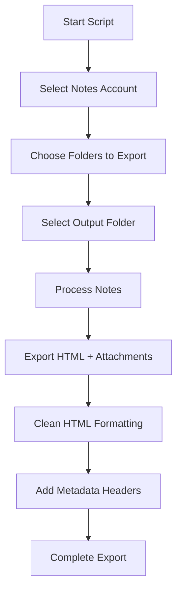
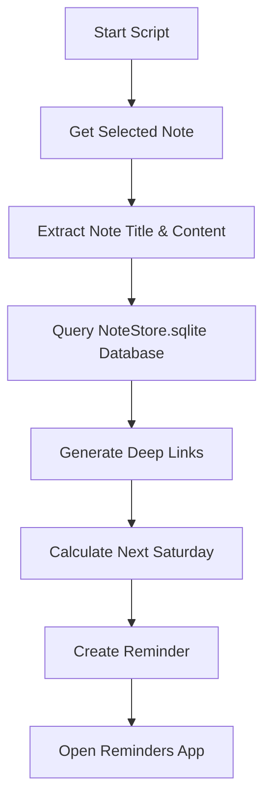

# Folder Level Apple Notes Exporter

Code base enhanced from [notes-export/notesExport.applescript at master · robertgaal/notes-export](https://github.com/robertgaal/notes-export/blob/master/notesExport.applescript)

## Enhancedments

added selection on folder level and individual notes

## how to Run `AppleNotesExportToHTML_v3.applescript`

copy the script to Apple script editor and run it.

# Apple Notes Exporter To HTML v3 Guide

## 📋 What This Script Does
This script exports Apple Notes to formatted HTML files with:
- Preserved folder structure
- Attachments handling (audio/video/PDF embeds)
- Clean HTML formatting
- Open Graph metadata support
- Customizable templates
- Multi-account support

## 🚀 How to Use

1. **Run the Script**  
   Double-click the `.applescript` file or run via Script Editor

2. **Select Account**  
   Choose which Notes account to export from

3. **Choose Folders**  
   Select specific folders or "All Notes"

4. **Pick Output Location**  
   Select a destination folder (empty directory recommended)

5. **Let It Run**  
   The script will:
   - Create mirrored folder structure
   - Export notes as HTML
   - Save attachments
   - Clean up formatting
   - Add metadata headers

## 🔄 Workflow Diagram


## 🛠 Customization Options

### 1. HTML Metadata (in `wrapHTML` handler)

### 2. HTML Styling
Modify the CSS in the `wrapHTML` handler:

### 3. Attachment Handling
Supported formats in `attList` loop:
- Video: .webm, .mp4, .mov
- Audio: .ogg, .mp3, .m4a
- Documents: .pdf

### 4. File Naming
Adjust sanitization rules:
```applescript
set baseFileName to my replaceText(baseFileName, ":", "-")
set baseFileName to my replaceText(baseFileName, "/", "-")
```

### 5. HTML Cleaning
Modify `preProcessHTML` for different cleanup needs:
```applescript
repeat while fileContent contains "<br><br>"
    set fileContent to my replaceText(fileContent, "<br><br>", "<br>")
end repeat
```

## 📂 Export Structure
```
ExportFolder/
├── Folder1/
│   ├── Note1.html
│   └── attachments/
│       ├── video.mp4
│       └── doc.pdf
└── Folder2/
    ├── Note2.html
    └── Subfolder/
        └── Note3.html
```

## ⚠️ Important Notes
1. Requires macOS Catalina (10.15) or newer
2. Needs permission to access Notes app
3. Password-protected notes are skipped
4. First run may require:
   - System Preferences > Security & Privacy > Automation
   - Check "Script Editor" and "Notes"

## 🐛 Error Handling
The script includes:
- File access error recovery
- Attachment failure fallbacks
- User-friendly error dialogs
- Cleanup routines for partial exports

## 🔄 Update Frequency
Can safely export multiple times - overwrites existing files but preserves folder structure.

# Apple Notes Export to Reminder Item (v1)

## 📋 What This Script Does
This script creates a reminder from a selected note in Apple Notes with:
- Note title as the reminder title
- First 100 characters of the note's second line as reminder body
- Deep links back to the original note (desktop and mobile versions)
- Due date set to the coming Saturday at 10:00 AM
- Reminder placed in the "Default" list

## 🚀 How to Use

1. **Open Apple Notes**
   Select the note you want to create a reminder for

2. **Run the Script**  
   Double-click the `.applescript` file or run via Script Editor

3. **Verification**
   - The selected note will open in a separate window
   - The script will extract information and create a reminder
   - Reminders app will open showing the newly created item

## 🔄 Workflow Diagram


## 📝 Technical Details

### Note Identification
The script uses SQLite to query the NoteStore.sqlite database to retrieve the real UUID of the note, allowing for proper deep linking.

> [!WARNING]
> Make sure go to System Preferences > Security & Privacy > Full Disk Access for Script Editor and enable it.

```applescript
-- Query the NoteStore.sqlite database to get the real note identifier (UUID)
set sqliteQuery to "SELECT ZIDENTIFIER FROM ZICCLOUDSYNCINGOBJECT WHERE Z_PK=" & internalPK & ";"
try
	set realNoteID to do shell script "/usr/bin/sqlite3 ~/Library/Group\\ Containers/group.com.apple.notes/NoteStore.sqlite " & quoted form of sqliteQuery
on error errMsg number errNum
	display dialog "Error retrieving note identifier: " & errMsg
	return
end try
```

### Deep Links
Two deep links are created:
- `notes://showNote?identifier=UUID` (Desktop)
- `mobilenotes://showNote?identifier=UUID` (iOS)

### Date Calculation
Automatically calculates the coming Saturday at 10:00 AM for the reminder due date.

## ⚠️ Important Notes
1. Requires macOS with access to both Notes and Reminders apps
2. Needs permission to:
   - Control Apple Notes
   - Control Reminders
   - Access your Notes database
3. Will create reminders in the "Default" list (create this list if it doesn't exist)
4. First-time use requires Automation permissions in System Preferences

